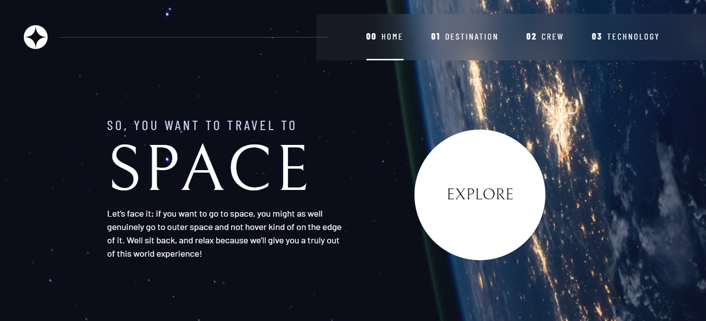
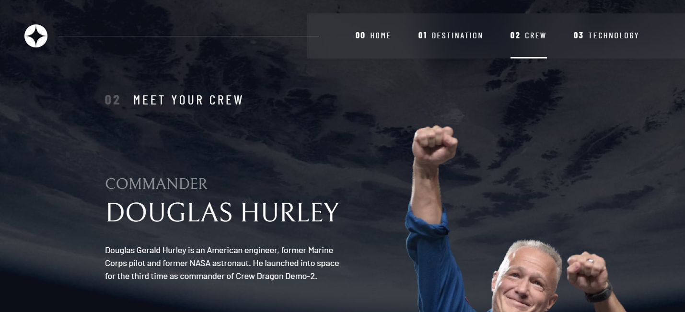
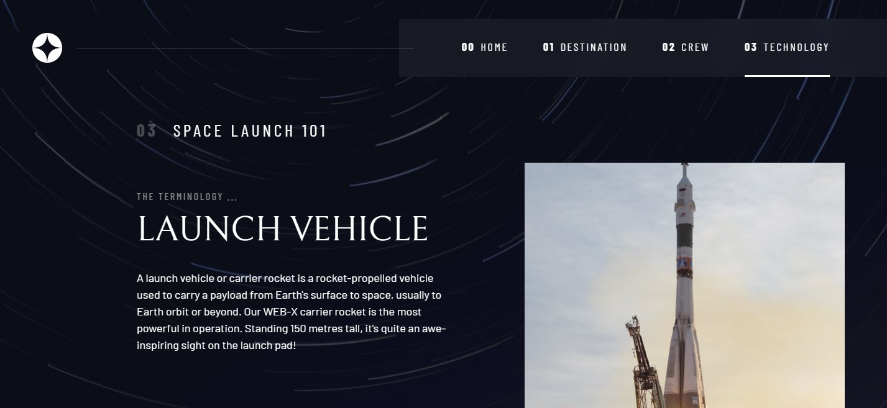
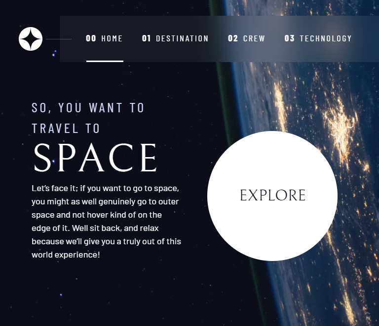
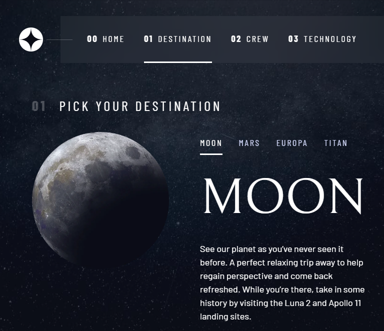
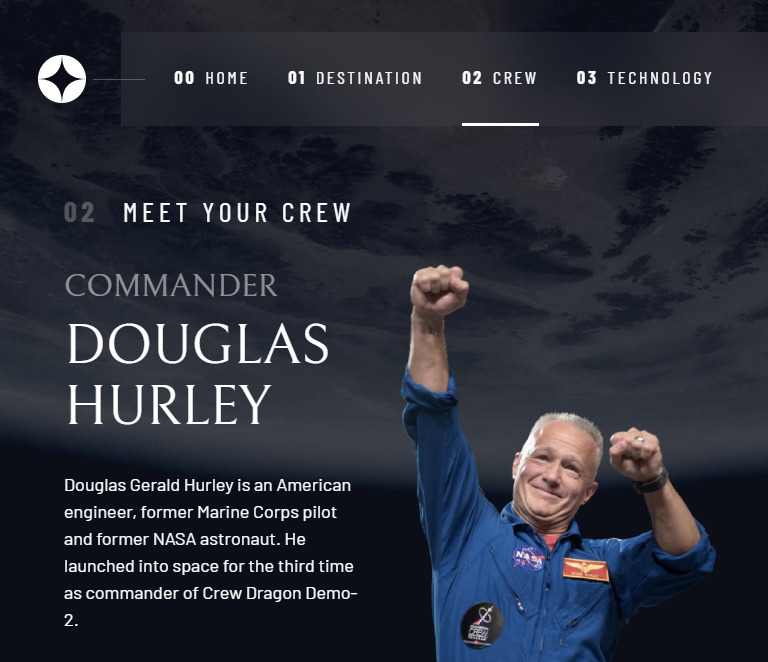
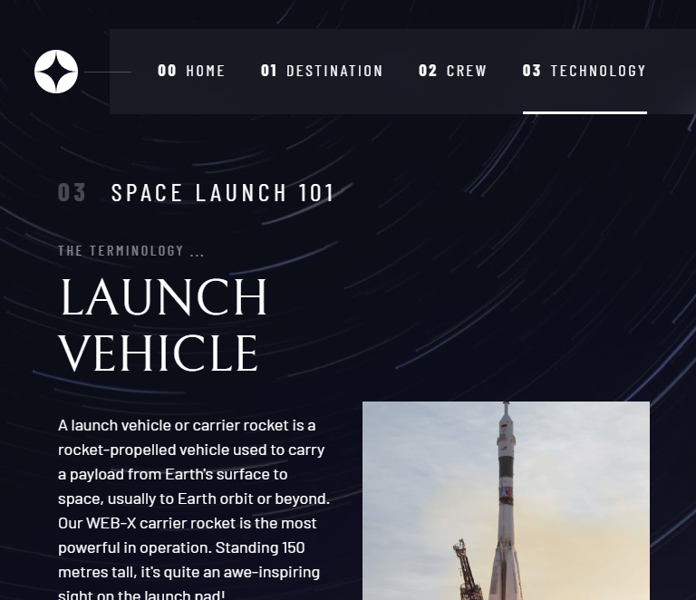
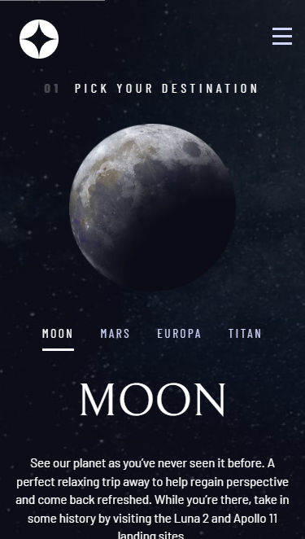
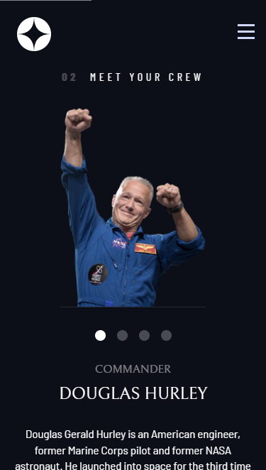
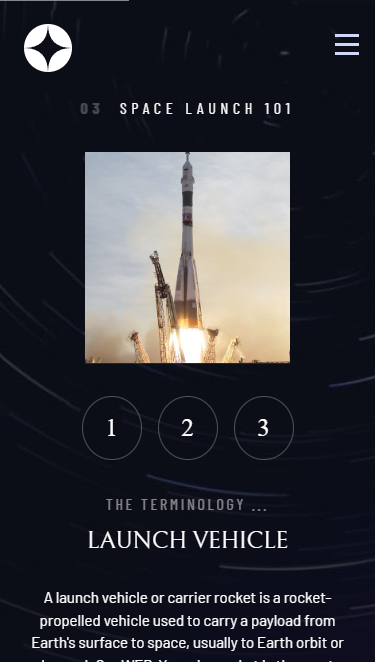

# Project Overview

## Table of contents

-  [Overview](#overview)
   -  [Features](#features)
   -  [Screenshots](#screenshots)
   -  [Links](#links)
-  [My process](#my-process)
   -  [Built with](#built-with)
   -  [What I learned](#what-i-learned)
   -  [Continued development](#continued-development)
   -  [Useful resources](#useful-resources)
-  [Author](#author)

## Overview

### Features

Users should be able to:

- View the layout for each of the website's pages depending on their device's screen size
- Toggle between each tab to view new information 
- See hover states for all interactive elements on the page

### Screenshots

***Desktop Layout*** (1440 X 900)\

***Tablet Layout*** (768 x 1024)\

***Mobile Layout*** (375 x 667) \

### Links

- Solution URL: [Github Respository](https://github.com/patrice111/space-tour.git)
- Live Site URL: [Hosted on Github Pages](https://patrice111.github.io/space-tour/)

## My process

### Built with

- HTML5 
- CSS3
- Flexbox
- Gridbox
- Vanilla JS

### What I learned

-  Non-technical skills:

   -    The best way for me to approach a project is to break down each task into smaller tasks 
   -    Notating/Planning what my process will be before starting the tasks helps as well. This allows me to follow a    guildline/checklist 
   -    Concepts I didn't understand or needed additional information on were saved & reviewed at the end of the day or following day. This allowed me to continue on with my workflow. 

-  Technical skills:
   -  Responsive UI/UX development
      -  Using the chrome inspector to emulate different screen sizes 
      -  Using chrome inspector to help me build out the site so I can see it in real time
   -  Grid & Flexbox as well as Javascript to create responsive and dynamic layouts

### Continued development

-  My goal is to continue to fine-tune my skillset to decrease my time on projects. To acheive this goal, I intend on creating projects to work on my time & effeciency. 

### Useful resources

-  [W3](https://www.w3schools.com/) - This site was referenced for CSS
-  [MDN](https://developer.mozilla.org/en-US/docs/Web/JavaScript) - This site was referenced for Javascript

## Author

-  Name: Patrice Kelly
-  Website - [Github Profile](https://github.com/patrice111)

